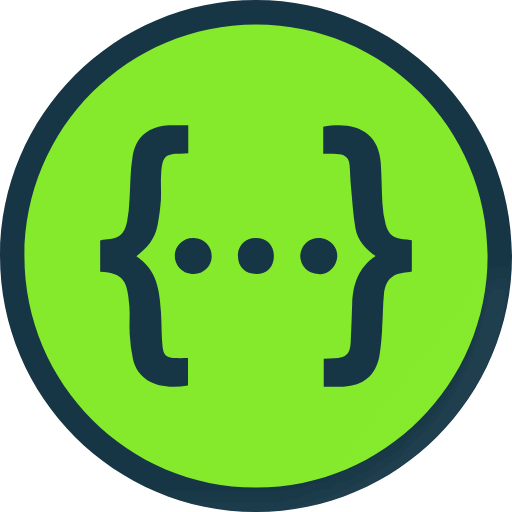
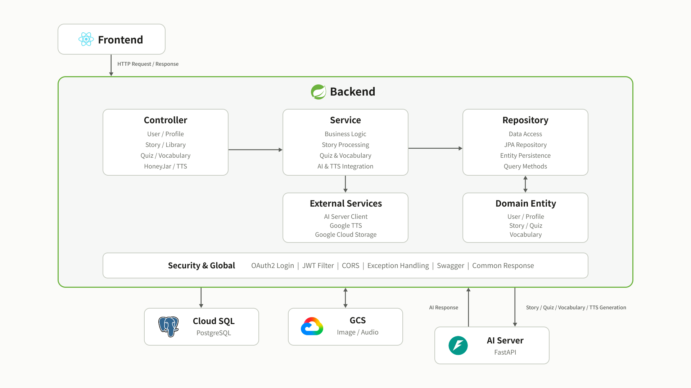
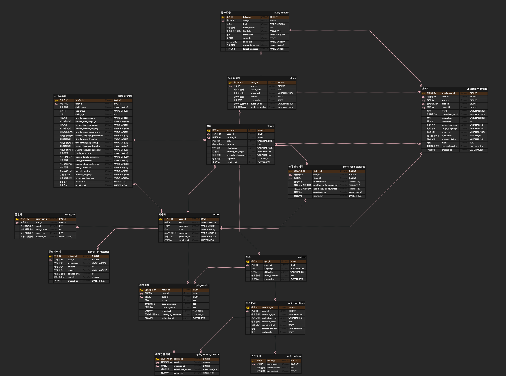

<br>

<div align="center">
    <div>
        <h2><b>MORETALE</b></h2>
        <p><i>More Language, More Tale!</i></p>
    </div>
</div>

<br>

<h1 align="center">MORETALE Backend</h1>

눈에 보이지 않는 곳에서 아이들의 이야기를 만드는 조용한 이야기꾼.

**MORETALE Backend**는 사용자의 언어와 경험을 연결하여 AI 동화 생성, 퀴즈, 단어 학습, 음성 생성, 보상 시스템까지 모든 기능이 자연스럽게 이어질 수 있도록 서비스를 뒷받침합니다.

서로 다른 언어와 경험을 하나의 이야기로 엮어, 아이들이 더 많은 언어와 더 넓은 세상을 만날 수 있도록 돕습니다.

<br>

<div align="center">

<a href="https://www.java.com/">
<kbd>

</kbd>
</a>

<a href="https://spring.io/projects/spring-boot">
<kbd>

</kbd>
</a>

<a href="https://gradle.org/">
<kbd>

</kbd>
</a>

<a href="https://www.postgresql.org/">
<kbd>

</kbd>
</a>

<a href="https://swagger.io/">
<kbd>

</kbd>
</a>

<a href="https://www.docker.com/">
<kbd>

</kbd>
</a>

<a href="https://cloud.google.com/">
<kbd>

</kbd>
</a>

</div>

<div align="center">

<h4>Java 21 | Spring | Gradle | PostgreSQL | Swagger | Docker | Google Cloud Platform</h4>

</div>


---

## 👥 Developer

<div align="center">

| <br><a href="https://github.com/chaeyylee"><b>Chaeyoung Lee</b></a> |
|:----------------------------------------------------------------------------------------------------------------------------:|
|                                             <i>Sookmyung Women's University</i>                                              |
|                                                        Lead, Backend                                                         |

</div>

---

## 📌 Overview

MORETALE Backend는 사용자 인증, 프로필 관리, 동화 생성 요청, 동화 보관함, 퀴즈, 단어장, TTS, 꿀단지 시스템 등 서비스의 핵심 비즈니스 로직을 담당하는 Spring Boot 기반 서버입니다.

Frontend에서 전달받은 사용자 요청을 처리하고, 필요한 경우 AI 서버와 통신하여 동화 생성, 퀴즈 생성, TTS 생성 등의 기능을 수행합니다.  
또한 생성된 동화 데이터, 사용자 프로필, 꿀단지 보상 내역, 단어장 정보 등을 PostgreSQL 데이터베이스에 저장하고 관리합니다.

MORETALE은 다문화 가정 어린이와 부모가 함께 사용할 수 있는 이중언어 동화 생성 서비스를 목표로 합니다.  
Backend는 사용자별 언어 설정, 프로필 정보, 생성된 콘텐츠의 저장 및 재사용 흐름을 안정적으로 관리하는 역할을 수행합니다.


---

## ⚒️ Detailed Tech Stack

| Role       | Type                                                                                                                                                                                                                                                                                                                                          |
|------------|-----------------------------------------------------------------------------------------------------------------------------------------------------------------------------------------------------------------------------------------------------------------------------------------------------------------------------------------------|
| Language   |                                                                                                                                                                                                                                          |
| Framework  |                                                                                                                                                                                                                        |
| Build Tool |                                                                                                                                                                                                                                            |
| Database   |                                                                                                                                                                                                                                |
| ORM        |                                                                                                                                                                                                                      |
| Security   |    |
| API Docs   |                                                                                                                                                                                                                                         |
| Cloud      |                                                                                                        |
| Storage    |                                                                                                                                                                                                                |
| Deployment |                                                                                                            |
| CI/CD      |                                                                                                                                                                                                                   |

---

## ✨ Core Features

### 🔐 Authentication

> Google OAuth2 기반 로그인을 지원합니다.

- Google OAuth2 로그인 처리
- 로그인 성공 후 JWT 발급
- Access Token 기반 사용자 인증
- 인증된 사용자 정보 조회
- 프론트엔드 리다이렉트 처리
- CORS 설정 및 인증 필터 구성

### 👤 User & Profile

> 사용자의 기본 정보와 동화 생성을 위한 프로필 정보를 관리합니다.

- 사용자 정보 저장
- 사용자 프로필 생성 및 수정
- 사용자의 주 언어 및 보조 언어 설정
- 온보딩 결과 저장
- 사용자 맞춤 동화 생성을 위한 프로필 데이터 제공

### 📖 Story
> AI 서버와 연동하여 사용자 맞춤형 동화를 생성하고 저장합니다.

- 동화 생성 요청 처리
- AI 서버로 사용자 프로필 및 요청 정보 전달
- 생성된 동화 제목, 내용, 이미지, 슬라이드 정보 저장
- 최근 생성 동화 조회
- 동화 상세 조회
- 추천 동화 정보 제공
- 사용자별 동화 보관함 관리

### 🧠 Quiz

> 생성된 동화를 기반으로 퀴즈 기능을 제공합니다.

- 동화 기반 퀴즈 생성 요청
- 퀴즈 문제 및 선택지 저장
- 사용자 정답 제출 처리
- 정답 여부 확인
- 퀴즈 결과 반환

### 🔊 TTS

> 동화 내용을 음성으로 들을 수 있도록 TTS 기능을 지원합니다.

- 동화 문장 기반 TTS 생성 요청
- 언어별 TTS locale 처리
- 생성된 오디오 URL 저장
- 프론트엔드에서 재생 가능한 음성 데이터 제공

### 🔤 Vocabulary

> 동화 속 단어를 학습할 수 있도록 단어장 기능을 관리합니다.

- 동화 기반 단어 저장
- 사용자별 단어장 조회
- 단어 의미 및 번역 정보 관리
- 학습용 단어 데이터 제공

### 🍯 Honey Jar

> 사용자의 활동 보상 시스템인 꿀단지 기능을 관리합니다.

- 꿀단지 적립
- 꿀단지 사용
- 현재 잔액 조회
- 획득 및 사용 이력 저장
- 동화 생성, 퀴즈 풀이 등 서비스 활동과 연동

---

## ⚙️ Architecture
> MORETALE Backend는 Frontend와 AI Server 사이에서 인증, 비즈니스 로직 처리, 데이터 저장을 담당하는 핵심 API 서버입니다.



---

## 📋 ERD
> 사용자, 프로필, 동화, 슬라이드, 퀴즈, 단어장, 꿀단지 이력 등을 중심으로 데이터베이스를 설계하였습니다.



---

## 🛫 Getting Started

### 1. Clone the Repository

```bash
git clone https://github.com/GDGoC-quadS-Team1/MoreTale-backend.git
cd MoreTale-backend
```

### 2. Create Environment File

`.env.example` 파일을 복사하여 `.env` 파일을 생성합니다.

```bash
cp .env.example .env
```

생성된 `.env` 파일에 필요한 값을 입력합니다.

주요 환경변수는 다음과 같습니다.

```env
PORT=8080
SPRING_PROFILES_ACTIVE=local

DB_URL=jdbc:postgresql://localhost:5432/moretale
DB_USERNAME=postgres
DB_PASSWORD=your_db_password_here

GOOGLE_CLIENT_ID=your_google_client_id_here
GOOGLE_CLIENT_SECRET=your_google_client_secret_here

JWT_SECRET=your_jwt_secret_here

FRONTEND_URL=http://localhost:5173

MORETALE_CORS_ALLOWED_ORIGINS=http://localhost:5173,http://127.0.0.1:5173

MORETALE_AI_BASE_URL=http://127.0.0.1:8000
MORETALE_AI_API_KEY=replace-with-ai-moretale-api-key

MORETALE_BACKEND_PUBLIC_BASE_URL=http://127.0.0.1:8080
```

전체 환경변수 목록은 `.env.example` 파일을 참고하세요.

### 3. Build the Project

프로젝트 루트 경로에서 아래 명령어를 실행합니다.

```bash
./gradlew build -x test
```

### 4. Run the Application

Gradle을 통해 바로 실행할 수 있습니다.

```bash
./gradlew bootRun
```

또는 빌드된 JAR 파일을 실행할 수 있습니다.

```bash
cd build/libs
java -jar MoreTale-0.0.1-SNAPSHOT.jar
```

### 5. Check the Server

서버가 정상적으로 실행되면 아래 주소로 접근할 수 있습니다.

```text
http://localhost:8080
```

---

## 🐳 Docker

### Build Docker Image

MORETALE Backend 애플리케이션을 Docker 이미지로 빌드합니다.

```bash
docker build -t moretale-backend .
```

### Run Docker Container

환경변수를 적용하여 Docker 컨테이너를 실행합니다.

```bash
docker run -p 8080:8080 --env-file .env moretale-backend
```
---

## 🚀 Deployment

> MORETALE Backend는 Google Cloud 기반으로 배포됩니다.

### Deployment Flow

```text
GitHub Repository
  ↓
GitHub Actions
  ↓
Gradle Build
  ↓
Docker Image Build
  ↓
Artifact Registry Push
  ↓
Cloud Run Deploy
```

### CI/CD Pipeline

GitHub Actions를 사용하여 `main` 또는 `develop` 브랜치에 변경 사항이 반영되면 백엔드 애플리케이션을 자동으로 빌드합니다.  
빌드된 애플리케이션은 Docker 이미지로 생성되어 Google Artifact Registry에 업로드되며, 이후 Google Cloud Run에 배포되어 최신 버전의 서비스를 운영 환경에 반영합니다.

### Cloud SQL Connection

Cloud Run 환경에서는 Cloud SQL Connector를 사용하여 PostgreSQL 데이터베이스에 연결합니다.  
이를 통해 공개 IP 기반 접근 대신 Google Cloud 내부 연결 방식을 사용할 수 있도록 구성했습니다.

---

## 📂 Folder Structure

```text
MoreTale-backend
├── src
│   ├── main
│   │   ├── java/com/moretale
│   │   │   ├── domain
│   │   │   │   ├── honeyjar
│   │   │   │   ├── profile
│   │   │   │   ├── quiz
│   │   │   │   ├── story
│   │   │   │   ├── tts
│   │   │   │   ├── user
│   │   │   │   └── vocabulary
│   │   │   │
│   │   │   ├── global
│   │   │   │   ├── common
│   │   │   │   ├── config
│   │   │   │   ├── controller
│   │   │   │   ├── exception
│   │   │   │   ├── security
│   │   │   │   ├── service
│   │   │   │   └── validation
│   │   │   │
│   │   │   └── MoreTaleBackendApplication.java
│   │   │
│   │   └── resources
│   │       ├── db.migration
│   │       │   ├── V2_add_onboarding_profile_fields.sql
│   │       │   ├── V2_language_enum_migration.sql
│   │       │   ├── V3_update_enum_values.sql
│   │       │   ├── V4_create_story_token_table.sql
│   │       │   └── V5_add_secondary_definition.sql
│   │       │
│   │       ├── application.yml
│   │       ├── application-local.yml (not included in github repo)
│   │       ├── application-prod.yml
│   │       ├── schema.sql
│   │       └── data.sql
│   │
│   └── test
│       └── java
│
├── .env (not included in github repo)
├── build.gradle
├── Dockerfile
└── README.md
```

### Domain Layer

| Domain     | Description         |
|------------|---------------------|
| honeyjar   | 꿀단지 적립, 사용 및 이력 관리  |
| profile    | 사용자 온보딩 및 프로필 정보 관리 |
| quiz       | 동화 기반 퀴즈 생성 및 채점    |
| story      | 동화 생성, 조회 및 보관함 관리  |
| tts        | 동화 음성 생성 기능         |
| user       | 사용자 정보 및 인증 관리      |
| vocabulary | 단어장 및 학습 단어 관리      |

### Global Layer

| Package    | Description           |
|------------|-----------------------|
| common     | 공통 응답 및 유틸 클래스        |
| config     | Spring 및 외부 서비스 설정    |
| controller | 공통 컨트롤러               |
| exception  | 예외 처리 및 에러 응답         |
| security   | OAuth2, JWT, 인증/인가 처리 |
| service    | 공통 서비스 로직             |
| validation | 요청 데이터 검증             |

### Database Migration

Flyway 기반 데이터베이스 버전 관리를 적용하였습니다.

- 온보딩 프로필 필드 추가
- 언어 Enum 마이그레이션
- Enum 값 변경
- Story Token 테이블 생성

---

## ✅ Main Contributions

- Spring Boot 기반 백엔드 서버 구조 설계
- Google OAuth2 로그인 및 JWT 인증 구조 구현
- 사용자 프로필 및 온보딩 데이터 관리
- AI 서버 연동을 통한 동화 생성 요청 처리
- 동화, 퀴즈, 단어장, TTS, 꿀단지 도메인 API 구현
- PostgreSQL 기반 데이터베이스 설계 및 JPA 연동
- Cloud Run, Cloud SQL, Docker 기반 배포 환경 구성
- CORS, 환경변수, 프로필 분리 등 운영 환경 설정